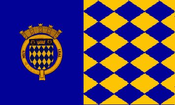

# Arecibo Website
 This small project was made by Carlos A. Galán De Arce and Cristopher Rosado Miranda for the Web Design Class. We decided to select the town Arecibo to express our grattitude in form of a website. This website contains a summary of the history, memorable places, the shield / flag of the town and mayor along with their 2016-2020 assembly members.
 
## Bandera de Arecibo 
 